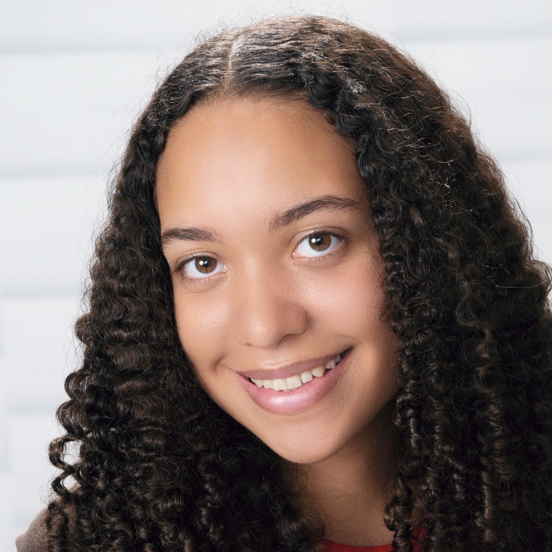

---
hide:
  - navigation
---

# Meet the Team

-   ## Peter Capriotti
    
    { .rounded-circle width="150" }
    
    I'm a senior graduating in May 2026 studying computer science. I'm very interested in AI, big data, and cybersecurity. In my free time, I love outdoor adventures, travelling, and music production. 

    **Contact**. 
    pacapriotti@crimson.ua.edu  
    [Let's connect on LinkedIn!](https://www.linkedin.com/in/peter-cap/)  
    

-   ## Holland Henderson-Boyer

    { .rounded-circle width="150" }

    Computer science and math major, UA class of 2026. I love exploring new cities, reading sci-fi and mysteries, and wrangling data :) After I graduate in May, I plan to move to the Bay Area to work as a software engineer at Netflix.  

    **Contact**  
    hrhendersonboyer@crimson.ua.edu   
    [Let's connect on LinkedIn!](https://www.linkedin.com/in/holland-henderson-boyer/)  
    [Check out my other projects!](https://holland-website-cursor.vercel.app/)

-   ## Alex Cunningham

    { .rounded-circle width="150" }

    Insert bio here 

    **Contact**   
    Email here  
    Linkedin here  
    Website here  

-   ## Pierce Daugherty

    { .rounded-circle width="150" }

    Im a computer science major graduating spring '26 from The University of Alabama. I enjoy cooking, tennis, and movies in my free time. I don't have concrete plans for after graduation, only that I would like to live in a big city. 

    **Contact**  
    pmdaugherty@crimson.ua.edu  
    [Let's connect on LinkedIn!](https://www.linkedin.com/in/p-daugherty/)  
    [Personal GitHub](https://github.com/pierced07)  

